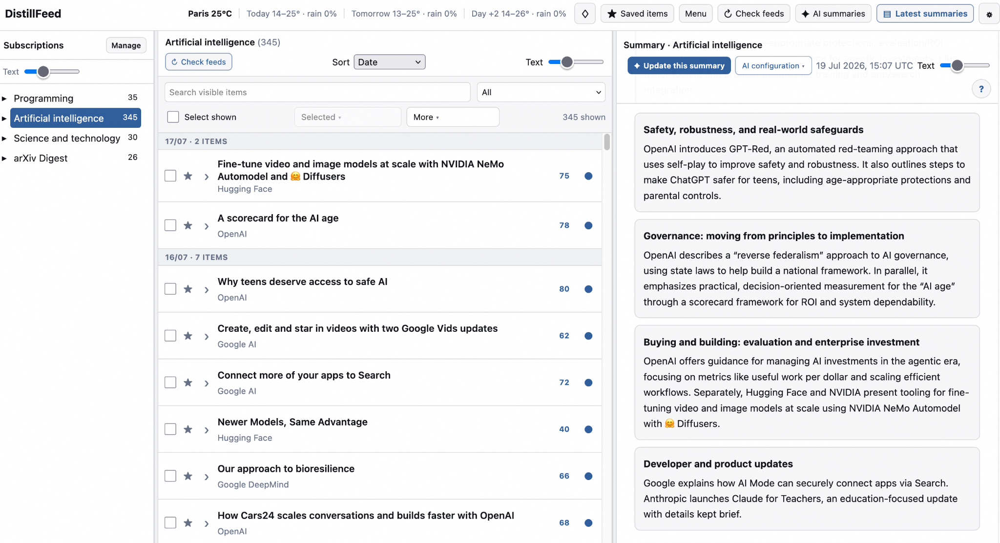
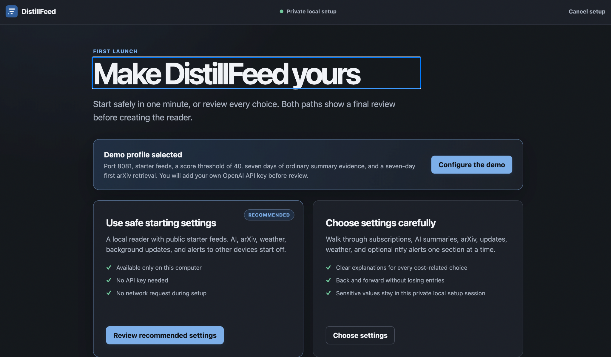
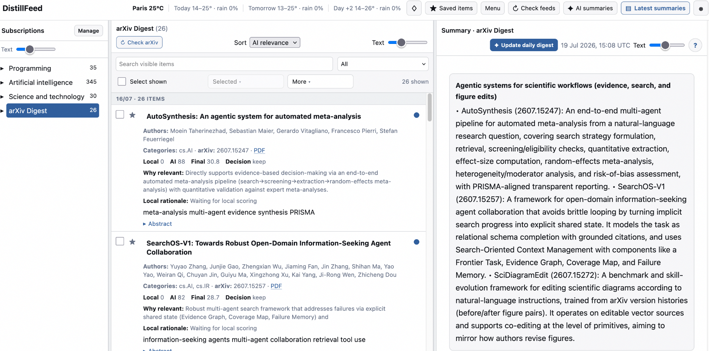
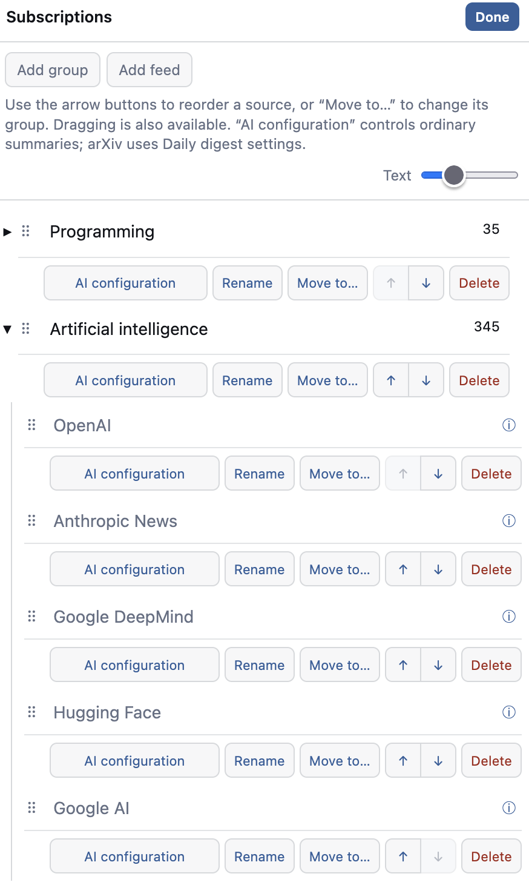

# DistillFeed
RSS reader that provides contents ranked by AI, as well as summaries. It checks feeds normally, stores the
articles locally, and can use OpenAI or Ollama to score new entries and write topic summaries.



## Highlights

- RSS and Atom reading with OPML import and export
- AI relevance scores and concise summaries
- A separate arXiv daily digest, included with the application
- Clear status messages for missing credentials, deferred work, retries and AI cost safeguards
- Per-group and per-feed rules for optional ntfy alerts
- OpenAI and local Ollama support
- A guided first launch
- Local use by default, with Docker and server deployment files included

## Install

DistillFeed requires Python 3.11 or newer on macOS or Linux.

Clone ```git clone https://github.com/ibaaj/distillfeed``` or download this repository, open a terminal in the project directory,
and run:

```bash
./launch.sh
```

On the first run, DistillFeed creates its own Python environment and opens a
local setup page. You can accept safe starting settings or review each section.
Nothing is saved until the final review, and setup does not contact feeds, 
arXiv, an AI provider or ntfy.



Later, use the same command to start the reader again. If the browser cannot
open automatically, run `./launch.sh --no-browser` and open the address shown
in the terminal.

Runtime files are stored in `.distillfeed/` and are ignored by Git.

## Demo setup

For the release demo, run:

```bash
./launch.sh --demo
```

The demo starts the guided setup with port 8081, public starter feeds, a summary
threshold of 40, a seven-day ordinary-summary window, and the arXiv `cs.AI`
digest with a seven-day first retrieval.

Enter an OpenAI API key during setup if you want the AI and arXiv parts of the
demo. The key is kept in the local secret store, not in the TOML configuration,
database, URL or setup manifest. If you do not want to enter a key, turn AI and
the arXiv digest off during setup; the feed reader still works normally.

## Feed checks and summaries

DistillFeed deliberately keeps these actions separate:

1. **Check feeds** downloads RSS or Atom documents and stores new entries. It
   does not use AI.
2. **Update summaries** checks readiness and cost safeguards, evaluates eligible
   entries, then publishes the affected summaries. This action can use AI.

Each update has a durable result. Reloading or closing the browser does not
erase its status, and an existing summary remains visible until its replacement
has completed successfully. Previously evaluated entries are not silently
rescored every time settings change.

Before an AI update starts, the interface reports missing credentials, the
planned workload, estimated local cost, budget limits, queued work and retryable
failures. The estimate is based on DistillFeed's own usage records; it is not a
provider account balance.

## arXiv daily digest

The bundled arXiv source has its own retrieval, scoring and digest settings inspired by this [project](https://github.com/ibaaj/arxiv-digest). Its first update can look back several days, so a weekend or holiday demo is not
limited to that day's announcement feed.



Enable and configure it during first launch, or later under **AI summaries**.
Use **Check arXiv** to retrieve papers and **Update daily digest** to produce the
digest.

## Subscriptions

Use **Manage** in the subscription panel to add, rename, move, reorder or delete
groups and feeds. Ordinary-summary rules can be set for either a group or a
single feed.

<p align="center">
  
</p>

## Notices and alerts

There are two separate notification features:

- **System notices** explain what DistillFeed itself is doing: completed
  updates, partial feed failures, missing AI configuration, retries, budget
  blocks and similar operational information.
- **Other devices** sends selected articles to an ntfy server. It is optional
  and can be limited to chosen OPML groups or feeds, each with its own relevance
  threshold. A feed rule takes precedence over its group rule.

Configure ntfy under **Settings → Other devices**. System notices do not require
ntfy and remain available inside the reader.

## Personal generated feeds

DistillFeed can read XML produced by a personal scraper without running that
scraper inside the web application. Set an administrator-controlled directory:

```toml
[feeds]
generated_feed_directory = "/srv/distillfeed/generated-feeds"
```

Have the separate collector atomically replace a regular file such as
`personal.xml`, then add `generated://personal.xml` as a subscription.
DistillFeed accepts only a basename in this URL, rejects symbolic links and
oversized files, and parses the result as an ordinary feed.

Do not add a feature that uploads and executes arbitrary Python scripts. Run
personal collectors as a separate unprivileged process or container with only
the network and filesystem access they need.

## Manual installation

The normal launch script is recommended. For an existing server workflow:

```bash
python3 -m venv .venv
. .venv/bin/activate
python -m pip install ".[server]"
cp config.example.toml config.toml
distillfeed init
distillfeed serve
```

The example configuration listens only on `127.0.0.1:8080`. Set
`OPENAI_API_KEY` before starting the server if you prefer an
environment-managed OpenAI credential.


## License

DistillFeed is released under the Apache License 2.0. See [LICENSE](LICENSE).
